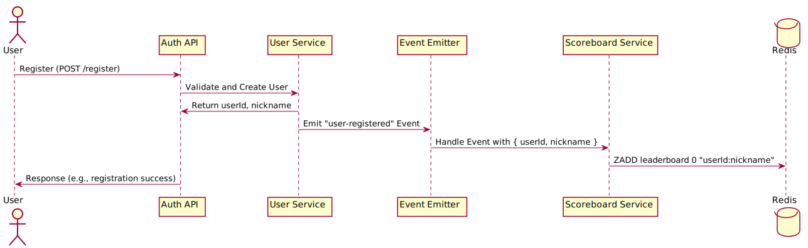
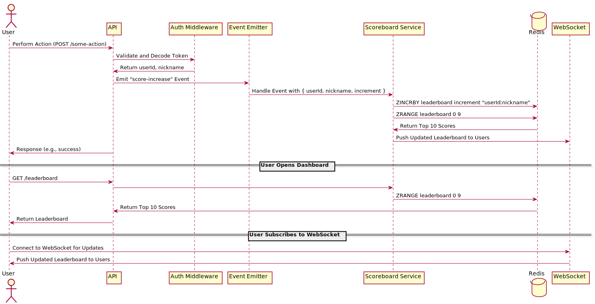

# Scoreboard Module

This module handles user scores and leaderboard functionalities. It is integrated with other existing modules and middlewares, such as the `Actions`, `User`, `Auth` utilizing "EventEmitter" for low coupling.

## Functionalities

- **User Registration event**: When a new user registers, the Scoreboard module initializes their score in both Redis and PostgreSQL.
- **Score Updates event**: Handles score increments and updates the leaderboard in real-time.
- **Leaderboard**: Provides the top 10 scores to users through API and WebSocket connections.

## Module Specification

### API Endpoints

- **GET /leaderboard**: Retrieves the top 10 scores from the leaderboard. Response body example:

```json
{
  "status": 200,
  "data": [
    {
      "userId": 1,
      "nickname": "string",
      "score": 140
    },
    ...
  ]
}
```

### Event Handling

- **user-registered**: Triggered when a user registers. Initializes the user's score in Redis. Payload: user id, nickname.
- **score-update**: Triggered when a user's score is updated. Updates the user's score in Redis and pushes the updated leaderboard to users via WebSocket. Payload: user id, nickname, score points to be added to user's total score.

### Data Storage

- **Redis**: Stores user scores in a sorted set (`leaderboard`) for quick leaderboard retrieval. It should support AOF persistance mechanism to prevent data loss. Score is stored in the "score" proterty, and "userId:nickname" in the "value" one.

Kindly follow for details: [Redis Sorted Set](https://redis.io/docs/latest/develop/data-types/sorted-sets/)

## Real-time Updates

- **WebSocket**: Pushes real-time updates to users when scores change, ensuring the leaderboard is always up-to-date.

## Visualized flows

### Diagram 1 - registration



### Diagram 2 - core logic



## Getting Started

To get started with the Scoreboard module, make sure the Auth/User modules and middlewares are already implemented so that we can add event triggers to them.
Follow the provided API endpoints and event handling procedures to implement and integrate the Scoreboard module into the application.

## Considerations

If score updates don't happen very often we should consider using polling instead of web sockets for simplicity.
Also we should consider writing batch updates with user score to `Postgres` for more robust data persistence and easier data access for analytics.
Event emitter might be replaced with some pub/sub system in case we move to microservices
